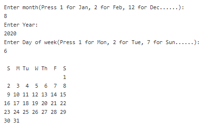

## Practice Statement: Digital calendar

**A software company wishes to help its employees plan and execute their projects in a better manner. The employer intends to have a uniform system that allows the employees to check and fill the progress details of their project. 
The company plans to release a digital calendar that will display the days of the month on a screen that looks similar to an analog calendar. It will take the day, month and year as input from the user and display it on the calendar.**

**Points to remember -
-Consider leap years while formulating the solution.
-The calendar loop should display the days of the month and ensure that only 7 dates are displayed in one row. In order to check the same use the below condition while looping

	((dayOfTheMonth + firstDayOfTheMonth)%7 == 0) || dayOfTheMonth   ==  daysInMonth

**Sample Input and Output**

